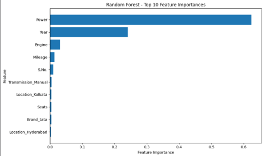
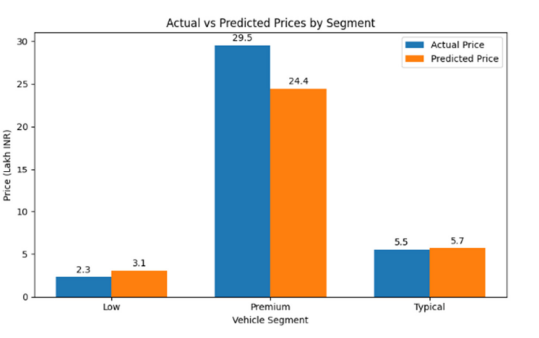
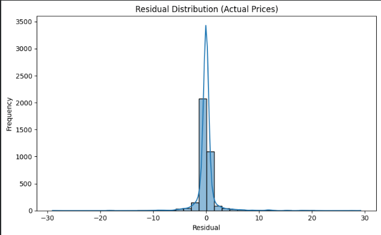

# 🚗 AI-Based Used Car Price Prediction (India)


---

## 📄 Project Overview

This project develops a machine learning model to predict used car prices in the Indian market.

Unlike typical ML projects, the focus is not only on prediction accuracy, but on understanding the **economic logic behind price formation**.

---

## 🎯 Key Results

* Best model: **Random Forest**
* Test performance: **R² ≈ 0.91**
* Lowest RMSE across all models
* Strong generalization with controlled overfitting

---

## 🧠 Core Insight

Used car prices follow a **dual structure**:

**1. Technical Value Drivers**

* Power
* Age
* Engine
* Mileage

**2. Market Adjustment Factors**

* Brand
* Model
* Location

👉 The model does not just predict prices —
it learns the **underlying pricing logic of the market**.

---

## 📊 Model Comparison

| Model               | Test R²   | Test RMSE |
| ------------------- | --------- | --------- |
| Linear Regression   | 0.866     | 3.994     |
| Decision Tree       | 0.875     | 3.858     |
| Tuned Decision Tree | 0.894     | 3.550     |
| Lasso Regression    | 0.884     | 3.710     |
| **Random Forest**   | **0.913** | **3.205** |

---

## 📈 Visual Insights

### Feature Importance



### Predicted vs Actual



### Residual Distribution



---

## 💰 Business Impact

Even small improvements in pricing accuracy generate significant value:

* Avg. vehicle price: ~9.48 lakh INR
* 1% improvement ≈ 9,480 INR per vehicle
* Scalable to **multi-million INR impact annually**

---

## 📄 Full Paper

👉 [Download Paper](paper/csaba_bakay_used_car_pricing.pdf)

---

## 🛠️ Tech Stack

* Python
* Scikit-learn
* Pandas / NumPy
* Matplotlib / Seaborn

---

## 📁 Repository Structure

```
used-car-price-prediction-india/
│
├── paper/
├── notebook/
├── Figures/
```

---

## 👤 Author

**Csaba Bakay**
MIT Professional
AI, Benchmarking & Cost Engineering

